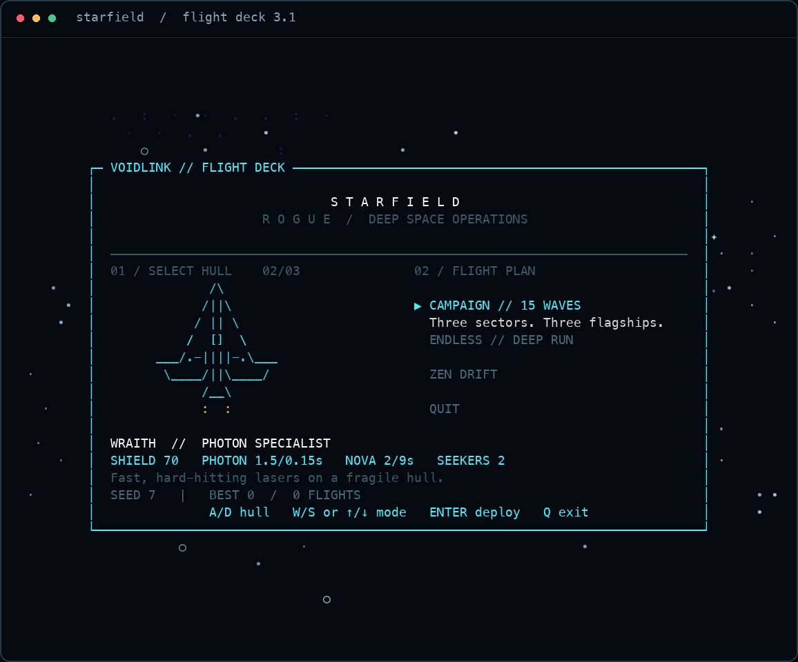
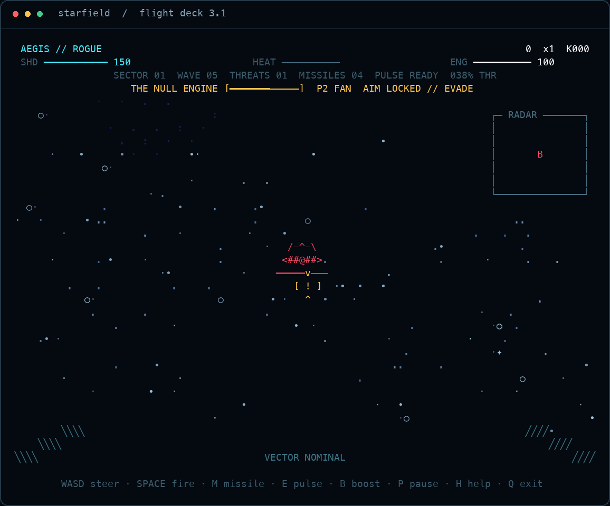
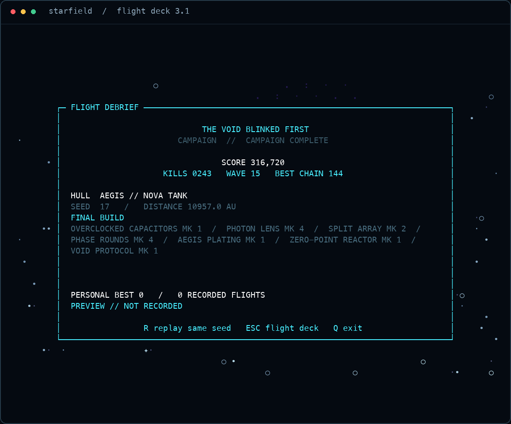

<div align="center">
 
<pre>
 ███████╗████████╗ █████╗ ██████╗ ███████╗██╗███████╗██╗     ██████╗
 ██╔════╝╚══██╔══╝██╔══██╗██╔══██╗██╔════╝██║██╔════╝██║     ██╔══██╗
 ███████╗   ██║   ███████║██████╔╝█████╗  ██║█████╗  ██║     ██║  ██║
 ╚════██║   ██║   ██╔══██║██╔══██╗██╔══╝  ██║██╔══╝  ██║     ██║  ██║
 ███████║   ██║   ██║  ██║██║  ██║██║     ██║███████╗███████╗██████╔╝
 ╚══════╝   ╚═╝   ╚═╝  ╚═╝╚═╝  ╚═╝╚═╝     ╚═╝╚══════╝╚══════╝╚═════╝
                       R O G U E  //  3.1 FLIGHT DECK
</pre>

**A full-blown deep-space combat roguelite inside your terminal.**

[](https://www.python.org/)
[](pyproject.toml)
[](https://github.com/fortunexbt/terminal-starfield/actions/workflows/test.yml)
[](LICENSE)

</div>



Fly the vanishing point. Shred strike wings. Evade plasma. Chain kills. Draft forbidden ship upgrades. Break three sector bosses and make the void blink first.

**Flight Deck 3.1:** choose a hull, read the boss's next strike, and build a flight record worth replaying. Every run shows its seed; replay it with the same ship to try a different build.

No engine. No assets. No runtime dependencies. Just Python, ANSI, and an unreasonable amount of terminal craft.

<table>
<tr>
<td width="50%"></td>
<td width="50%"></td>
</tr>
<tr>
<td align="center"><strong>Read the strike. Leave the lane.</strong></td>
<td align="center"><strong>Review the build. Fly it again.</strong></td>
</tr>
</table>

## Deploy

```bash
git clone https://github.com/fortunexbt/terminal-starfield.git
cd terminal-starfield
python3 starfield.py
```

Use a modern macOS/Linux terminal or Windows Terminal through WSL. Python 3.9+ is recommended.

For a global command:

```bash
python3 -m pip install .
starfield
```

## Choose your run

- **Campaign** — 15 escalating waves, upgrade drafts, three named bosses, one ending.
- **Endless** — uncapped waves and sector scaling. The build ends when you do.
- **Zen Drift** — the HUD-free, steerable descendant of the original starfield.

## Choose your ship

Use **A/D** or **left/right** on the flight deck, then **W/S** and **Enter** to deploy.

| Hull | Shields | Photon damage / cooldown | Nova damage / cooldown | Seekers | Style |
|:--|--:|:--|:--|--:|:--|
| **Vanguard** | 100 | 1 / 0.19s | 2 / 9s | 3 | Balanced interceptor |
| **Wraith** | 70 | 1.5 / 0.15s | 2 / 9s | 2 | Fast photon specialist; hotter weapons and less armor |
| **Aegis** | 150 | 1 / 0.26s | 4 / 7s | 4 | Nova tank; slower primary fire |

These are starting stats. Wave drafts shape the rest of the build. Zen and Voyage retain their original flight controls.

## Combat loop

Every contact exists in projected 3D space. Steer the flight vector onto a target, fire down the reticle, and keep moving when plasma closes on your lane.

- Photon arrays build heat and lock out when overdriven.
- Seekers acquire the closest target inside the lock cone and home through 3D space.
- Nova pulse consumes reactor energy, scrubs nearby plasma, and damages close enemies.
- Vector boost burns energy for extreme speed and extended light trails.
- Kills grow a multiplier; collisions and plasma reset it.
- Destroyed enemies can drop repairs, energy, missiles, or score caches.
- Every cleared wave offers one of three upgrades. Builds stack and combine.

## Flight controls

| Control | System |
|:--|:--|
| <kbd>W</kbd><kbd>A</kbd><kbd>S</kbd><kbd>D</kbd> | Steer the flight vector |
| <kbd>↑</kbd> <kbd>↓</kbd> | Increase / decrease throttle |
| <kbd>←</kbd> <kbd>→</kbd> | Alternate horizontal steering |
| <kbd>Space</kbd> | Fire photon array |
| <kbd>M</kbd> | Launch homing seeker |
| <kbd>E</kbd> | Trigger nova pulse |
| <kbd>B</kbd> | Engage vector boost |
| <kbd>1</kbd>–<kbd>3</kbd> | Install an offered upgrade |
| <kbd>1</kbd>–<kbd>5</kbd> or <kbd>[</kbd> <kbd>]</kbd> | Change star density during flight |
| <kbd>T</kbd> / <kbd>C</kbd> | Toggle trails / cycle color system |
| <kbd>H</kbd> | Context-aware flight manual |
| <kbd>P</kbd> | Suspend flight |
| <kbd>R</kbd> | Replay the same seed and selected ship |
| <kbd>Esc</kbd> | Close help/resume; return to title from a debrief |
| <kbd>Q</kbd> | Exit safely |

## Threat index

| Silhouette | Class | Behavior |
|:--:|:--|:--|
| `▽` | Scout | Fast attack craft; fragile, hard to track |
| `◆` | Hunter | Armed interceptor; fires aimed plasma |
| `╬` | Frigate | Armored gun platform with a visible hull bar |
| `▣` | Sector boss | Holds engagement depth; three telegraphed attack phases |

The tactical radar tracks hostiles and pickups outside the central sight picture.

Bosses cannot be skipped by waiting. Above two-thirds hull they fire a **Lance**; below that, a five-lane **Fan**; the final third becomes faster **Crossfire**. The warning commits to your current flight vector before the shot. Move away from the marked impact point, then return fire. Defeat all three sector bosses to complete the campaign.

## Upgrade matrix

Runs can stack photon damage, fire rate, split lanes, piercing rounds, max shields, nova cooldown, missile fabrication, cryogenic cooling, and score yield. Maxed split-array, rapid-fire, and reactor upgrades leave the draft pool. Fabricators grant three seekers per installed level each wave, up to twelve.

Combat has its own seeded random generator: changing star density, themes, or time spent in the hangar does not change spawns and drafts. The same seed, ship, inputs, and simulation steps reproduce a run. Different combat decisions can change later random outcomes; a seed is not a recorded input replay.


## Bend the universe

```bash
# Skip the menu
python3 starfield.py --mode endless --ship wraith --stars 650 --theme 2 --fps 90

# Replay a flight from its debrief
python3 starfield.py --mode campaign --ship aegis --seed 7

# Original screensaver soul
python3 starfield.py --zen

# Deterministic visual capture
python3 starfield.py --snapshot 100x30 --seed 7 --no-color
python3 starfield.py --snapshot 100x30 --snapshot-screen title --ship wraith

# Machine-readable live game state for automation
python3 starfield.py --state-snapshot --seed 7

# Maximum compatibility
python3 starfield.py --ascii --no-color
```

Run `python3 starfield.py --help` for every option.

## Your flight log

Completed Campaign and Endless runs save their ship, seed, outcome, score, kills, wave, best chain, and duration. The title shows your personal best; the debrief shows the installed build and save result. Abandoned runs, Zen, Voyage, and snapshots do not count.

```bash
python3 starfield.py --records                         # inspect local history as JSON
python3 starfield.py --no-record                       # play without reading or saving a log
python3 starfield.py --record-file ./my-flights.json    # choose a different location
```

The default is `$XDG_DATA_HOME/terminal-starfield/flight-log.json`, or `~/.local/share/terminal-starfield/flight-log.json`. The log keeps your latest 30 completed flights, all-time best, and total count. Writes are atomic and serialized across sessions. An unreadable or malformed log is preserved and reported as unavailable; flight continues. Records are local to your machine.

## Why the terminal version hits differently

- Perspective-correct projection with inertial two-axis steering
- Depth-aware spectral stars, twinkle, vector streaks, projectiles, and explosions
- Responsive cockpit, micro-HUD, radar, boss telemetry, and alternate-screen rendering
- Deterministic simulation completely separated from rendering and raw terminal I/O
- Exact-width output from `20×8` upward, four true-color systems, and ASCII fallback
- Safe cursor, wrap, resize, SIGTERM, and TTY restoration
- Zero runtime dependencies

## Verify the entire game

```bash
python3 -m unittest discover -s tests -v
python3 starfield.py --snapshot 80x24 --no-color --ascii
python3 starfield.py --state-snapshot --seed 42
```

The suite covers the complete 15-wave campaign, loadouts, deterministic replay, boss phases and evasion, combat systems, capped drafts, compact layouts, full ASCII output, record integrity, concurrent saves, and real pseudo-terminal input/restoration. CI runs on Linux and macOS across Python 3.9 and 3.13.

## License

MIT. Built for people who still believe the terminal can become a place.
