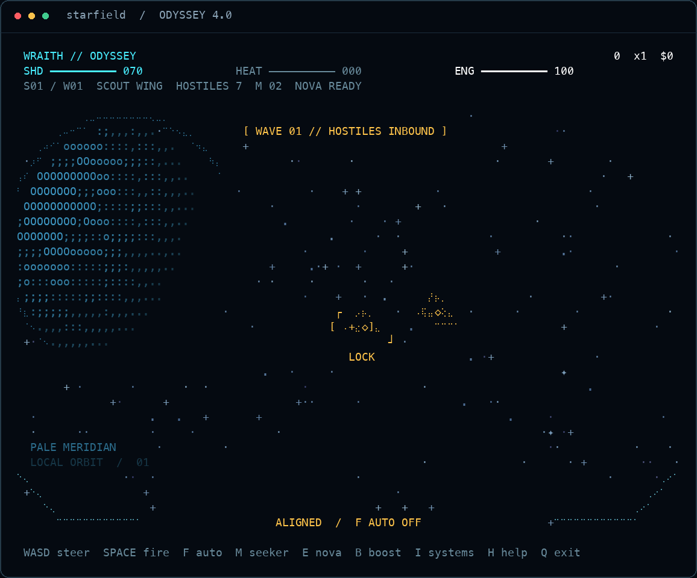
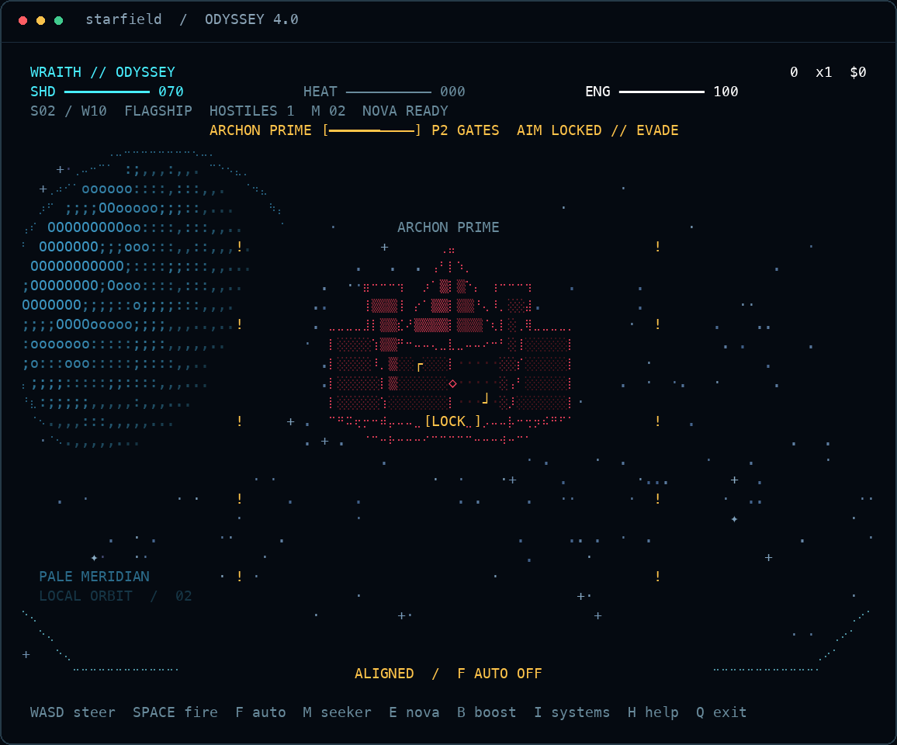

<div align="center">
 
<pre>
 ███████╗████████╗ █████╗ ██████╗ ███████╗██╗███████╗██╗     ██████╗
 ██╔════╝╚══██╔══╝██╔══██╗██╔══██╗██╔════╝██║██╔════╝██║     ██╔══██╗
 ███████╗   ██║   ███████║██████╔╝█████╗  ██║█████╗  ██║     ██║  ██║
 ╚════██║   ██║   ██╔══██║██╔══██╗██╔══╝  ██║██╔══╝  ██║     ██║  ██║
 ███████║   ██║   ██║  ██║██║  ██║██║     ██║███████╗███████╗██████╔╝
 ╚══════╝   ╚═╝   ╚═╝  ╚═╝╚═╝  ╚═╝╚═╝     ╚═╝╚══════╝╚══════╝╚═════╝
                       R O G U E  //  4.0 ODYSSEY
</pre>

**A seeded space-combat roguelite rendered in your terminal.**

[](https://www.python.org/)
[](pyproject.toml)
[](https://github.com/fortunexbt/terminal-starfield/actions/workflows/test.yml)
[](LICENSE)

</div>



**Starfield Rogue 4.0 — Odyssey** combines projected 3D flight, three ship loadouts, branching sector routes, and upgrade drafts. Line up contacts in the centered sight, manage weapon heat, and move away from committed plasma strikes.

Odyssey adds shaded planetary worlds, orbital rings and ruins, distinct flagship hulls, automatic primary fire, optional mouse controls, paid refit services, a ship systems inventory, and a demonstration pilot. The renderer uses procedural geometry, ANSI color, and optional Braille subcells; `--ascii` provides a complete ASCII fallback.

Python 3.9+ is required. There are **zero runtime dependencies**.

## Install and launch

```bash
git clone https://github.com/fortunexbt/terminal-starfield.git
cd terminal-starfield
python3 starfield.py
```

Use a modern macOS or Linux terminal, or Windows Terminal through WSL. Interactive play requires a TTY. A monospaced font with box-drawing, block-shading, and Braille glyphs shows the full artwork; use `--ascii` when those glyphs are unavailable.

For an installed command:

```bash
python3 -m pip install .
starfield
```

## Choose a run

| Mode | Flight plan | Direct launch |
|:--|:--|:--|
| **Campaign** | 15 waves across three sectors, ending with the third flagship | `--mode campaign` |
| **Endless** | Continuing waves and sector progression; flagship profiles repeat | `--mode endless` |
| **Zen Drift** | Steerable starfield without the combat HUD | `--zen` or `--mode zen` |
| **Voyage** | Capture signals, avoid debris, and build a chain | `--mode voyage` |

The flight deck offers Campaign, Endless, and Zen Drift. Start Voyage directly with its command-line option. In Zen and Voyage, **Space** boosts and **Z** toggles Zen Drift.

## Choose a ship

Use **A/D** or **left/right** to select a hull on the flight deck, then **W/S** or **up/down** to select a mode and **Enter** to launch. **F** sets automatic primary fire before departure.

| Hull | Starting shields | Photon damage / cooldown | Nova damage / cooldown | Starting seekers |
|:--|--:|:--|:--|--:|
| **Vanguard** | 100 | 1 / 0.19s | 2 / 9s | 3 |
| **Wraith** | 70 | 1.5 / 0.15s | 2 / 9s | 2 |
| **Aegis** | 150 | 1 / 0.26s | 4 / 7s | 4 |

Vanguard is the balanced interceptor. Wraith trades shields for faster, stronger photons with more heat per shot. Aegis has the largest shield reserve and stronger nova, with slower primary fire. These are starting values; upgrades and the active route change the effective build.

## Fly and fight

Steering moves the flight vector through the projected scene. The reticle shows primary alignment, while **LOCK** indicates that the selected target is inside the seeker cone. Off-axis markers point toward contacts outside the viewport.

- **Photons** fire down the sight with a narrow alignment assist. Shots build heat; overheated weapons must cool. A Space press is briefly buffered when the weapon is nearly ready.
- **Automatic fire** uses the same primary weapon and heat rules. It fires only while a target is aligned; the pilot still steers and evades.
- **Seekers** home toward the selected target when it is inside the lock cone and ammunition is available.
- **Nova** costs 35 energy, clears nearby plasma, and damages close enemies.
- **Boost** spends energy to increase speed. Kills build the score multiplier; damage resets the chain.
- **Salvage** supplies shield repairs, energy, seekers, and credits. Remaining pickups are banked when a wave clears.
- **Grazes** reward near misses from hostile fire with score. Event Horizon upgrades also recharge energy.

### Combat controls

| Control | Action |
|:--|:--|
| **W A S D** | Steer the flight vector |
| **↑ / ↓** | Increase / decrease throttle |
| **← / →** | Alternate horizontal steering |
| **Space** | Request a photon shot; resume when paused |
| **F** | Toggle automatic primary fire |
| **M** | Launch a seeker |
| **E** | Trigger nova |
| **B** | Boost |
| **I** | Open or close ship systems; inspect installed upgrades and effective weapon values |
| **H / ?** | Open or close the flight manual |
| **P** | Pause or resume |
| **R** | Restart with the same seed and selected ship |
| **T / C** | Toggle trails / cycle color theme |
| **1–5**, **[ / ]** | Change star density during flight |
| **Esc** | Close an overlay or resume; return to the flight deck from a debrief |
| **Q** | Exit |

The manual and systems inventory suspend simulation. The inventory is also available during refit. Route and upgrade screens use their own numbered choices.

### Optional mouse controls

```bash
python3 starfield.py --mode campaign --mouse --auto-fire
```

In a terminal that supports SGR mouse reporting, pointer position steers the flight vector, the left button requests a primary shot, the right button launches a seeker, and the wheel changes throttle. Aim with the centered sight: the pointer controls steering rather than selecting a target under the cursor. Mouse reporting is enabled only with `--mouse` and disabled when the terminal session exits.

## Refit between waves

A cleared wave restores 12 shield, up to the hull's maximum, and offers three upgrade cards. Choose **1**, **2**, or **3** for one free installation and departure. Each card shows its rank and effect change.

Spend credits on services **before** selecting the free upgrade:

| Key | Service | Cost | Effect |
|:--:|:--|--:|:--|
| **4** | Field Repair | 12 | Restore up to 30 shield |
| **5** | Seeker Crate | 10 | Add up to 3 seekers, capped at 12 |
| **6** | Reroute Draft | 8, then 16 | Replace the offered draft; at most twice per wave |

Unavailable services do not spend credits. Installing an upgrade leaves the refit screen; the final Campaign victory goes directly to the debrief.

Build options include photon damage, cooldown, extra lanes, piercing, maximum shields, nova cooldown, seeker fabrication, cooling, and score yield. Capped upgrades leave the draft pool when maxed. Fabricators supply three seekers per installed rank at the start of each wave, up to twelve.

Odyssey adds four more upgrade paths:

| Upgrade | Effect per installed rank | Rank cap |
|:--|:--|--:|
| **Siphon Array** | Kills restore 2 shield | 3 |
| **Event Horizon** | Grazes restore 8 energy | 2 |
| **Arc Relay** | Seeker kills arc 2 damage to nearby contacts | 2 |
| **Nova Echo** | Each nova use fabricates 1 seeker | 1 |

## Choose the next sector

Campaign starts at **Pale Meridian**, with standard modifiers. After the flagships on waves 5 and 10, finish the refit and choose a destination with **1**, **2**, or **3**. A short jump transition leads into the next sector. Endless offers the same route choice after each flagship.

| Destination | Risk | Benefit |
|:--|:--|:--|
| **Ember Forge** | +25% weapon heat | +60% score and credit salvage |
| **Ion Veil** | +25% hostile plasma speed | −30% weapon heat |
| **Titan Graveyard** | +25% enemy hull | An extra 12 shield restored after each wave |

The chosen route supplies the active modifiers and scenery until another route is selected. Repairs remain capped by maximum shield.

## Read the threat

Scouts dive inward, hunters strafe and commit aimed plasma shots, and frigates apply slower pressure with a three-lane volley. Flagships hold engagement depth and change attack phase as their hull falls.



| Flagship | Phase 1 | Phase 2 | Phase 3 |
|:--|:--|:--|:--|
| **The Null Engine** | Lance | Fan | Crossfire |
| **Archon Prime** | Hammer | Gates | Crucible |
| **Void Seraph** | Halo | Spiral | Crown |

Warning marks show the committed impact positions at the player collision plane. The aim, phase, and pattern are latched before firing; damaging a boss into another phase does not rewrite the volley already being advertised. Steering moves the marked positions relative to the sight. Evade the marked lanes and use the recovery interval to line up another attack.

## Launch options and previews

```bash
# Start an Endless run with automatic primary fire
python3 starfield.py --mode endless --ship wraith --auto-fire --stars 650 --theme 2 --fps 90

# Start a known seed with the selected hull
python3 starfield.py --mode campaign --ship aegis --seed 7

# Watch a demonstration pilot; any key returns to the flight deck, Q exits
python3 starfield.py --demo --seed 7

# Original signal-and-debris flight
python3 starfield.py --mode voyage

# Quiet starfield
python3 starfield.py --zen

# Deterministic, non-interactive visual fixtures
python3 starfield.py --snapshot 100x34 --seed 7 --no-color
python3 starfield.py --snapshot 100x34 --snapshot-screen boss --seed 7
python3 starfield.py --snapshot 80x24 --snapshot-screen route --ascii --no-color

# A deterministic state fixture as JSON
python3 starfield.py --state-snapshot --snapshot-screen systems --seed 7

# ASCII glyphs without color
python3 starfield.py --ascii --no-color
```

`--demo` supports Campaign and Endless and never records a demonstration run. It uses a pilot driving the simulation, so encounters still resolve through gameplay. It does not guarantee a winning run.

`--snapshot-screen` supports `playing`, `title`, `upgrade`, `game_over`, `victory`, `route`, `jump`, `boss`, and `systems`. Snapshots construct preview states and exit; they do not attach to an existing interactive session or read or write flight records. JSON includes route history and choices, target alignment and lock, weapon state, services, run statistics, and committed boss attack information.

Run `python3 starfield.py --help` for all options. Frame output supports exact dimensions from **20×8** upward, four color themes, and ASCII-only rendering. `NO_COLOR` also disables color.

## Seeds and flight records

Simulation advances in fixed **120 Hz** steps; rendering has a separately configurable frame rate. Combat and cosmetic stars use separate random generators, so changing star density or theme does not consume combat randomness. The same ruleset, seed, hull, and inputs at the same simulation times reproduce a run. Different choices can change later random outcomes. A seed is not a saved input replay, and an older ruleset can produce a different run.

Completed Campaign and Endless flights save mode, ship, seed, outcome, score, kills, wave, best chain, and duration. Odyssey entries also include the game ruleset version, route history (up to the last 32 stops), accuracy, grazes, and bosses defeated. Older logs remain readable. The debrief shows run statistics, route journey, the installed build, and record status; the title shows the personal best and recorded flight count.

Abandoned runs, demos, Zen, Voyage, and snapshots do not count. Records are local to the machine.

```bash
python3 starfield.py --records                         # inspect local history as JSON
python3 starfield.py --no-record                       # disable log reads and writes
python3 starfield.py --record-file ./my-flights.json    # choose a different location
```

The default path is `$XDG_DATA_HOME/terminal-starfield/flight-log.json`, or `~/.local/share/terminal-starfield/flight-log.json`. The log retains the latest 30 completed flights, the all-time best, and the total count. Writes are atomic and serialized across sessions. An unreadable or malformed log is preserved and reported as unavailable while play continues.

## Development checks

```bash
python3 -m unittest discover -s tests -v
python3 starfield.py --snapshot 80x24 --no-color --ascii
python3 starfield.py --state-snapshot --seed 42
```

The tests cover simulation and rendering separately, including fixed-step timing, swept collisions, committed volleys, route progression, refit services, loadouts, compact and ASCII layouts, input parsing, flight records, and pseudo-terminal restoration. The CI matrix runs Linux and macOS with Python 3.9 and 3.13.

## License

[MIT](LICENSE).
