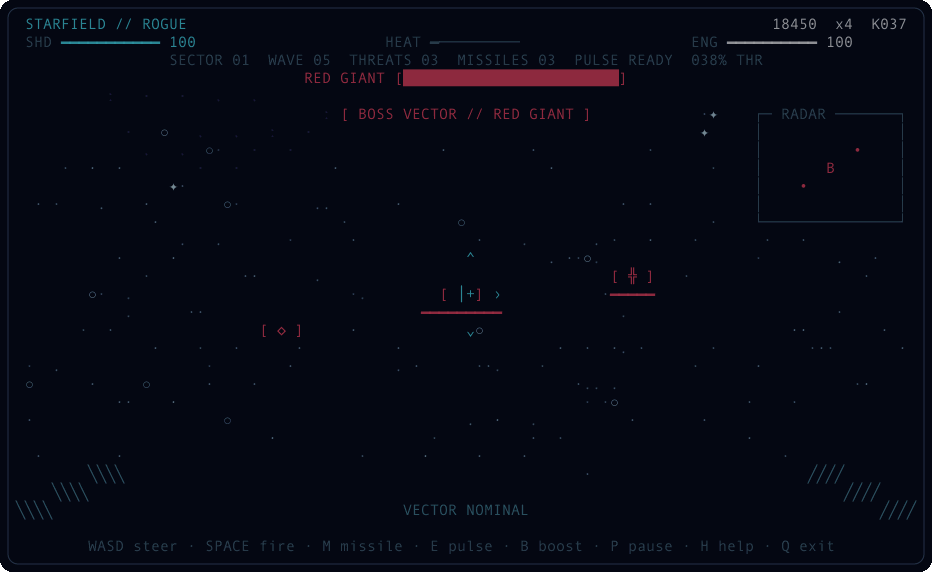
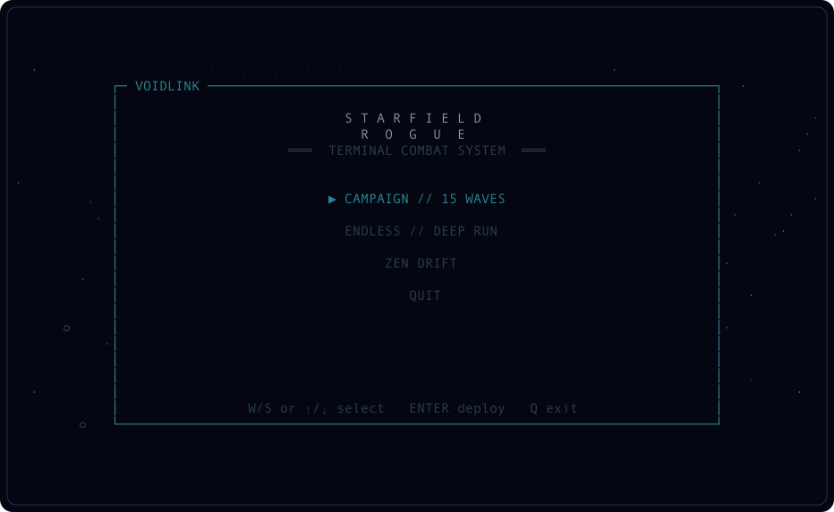
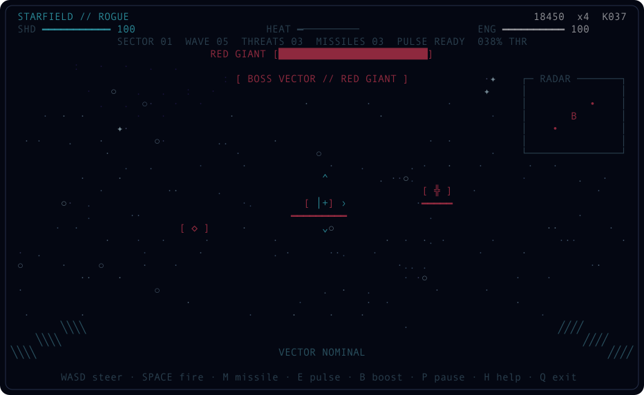
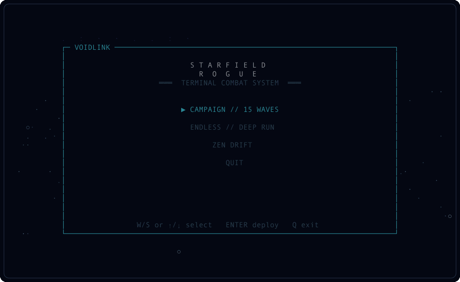

<div align="center">
 
<pre>
 ███████╗████████╗ █████╗ ██████╗ ███████╗██╗███████╗██╗     ██████╗
 ██╔════╝╚══██╔══╝██╔══██╗██╔══██╗██╔════╝██║██╔════╝██║     ██╔══██╗
 ███████╗   ██║   ███████║██████╔╝█████╗  ██║█████╗  ██║     ██║  ██║
 ╚════██║   ██║   ██╔══██║██╔══██╗██╔══╝  ██║██╔══╝  ██║     ██║  ██║
 ███████║   ██║   ██║  ██║██║  ██║██║     ██║███████╗███████╗██████╔╝
 ╚══════╝   ╚═╝   ╚═╝  ╚═╝╚═╝  ╚═╝╚═╝     ╚═╝╚══════╝╚══════╝╚═════╝
                           R O G U E  //  3.0
</pre>

**A full-blown deep-space combat roguelite inside your terminal.**

[](https://www.python.org/)
[](pyproject.toml)
[](https://github.com/fortunexbt/terminal-starfield/actions/workflows/test.yml)
[](LICENSE)

</div>



Fly the vanishing point. Shred strike wings. Evade plasma. Chain kills. Draft forbidden ship upgrades. Break three sector bosses and make the void blink first.

No engine. No assets. No runtime dependencies. Just Python, ANSI, and an unreasonable amount of terminal craft.

<table>
<tr>
<td width="50%"></td>
<td width="50%"></td>
</tr>
<tr>
<td align="center"><strong>Choose the run</strong></td>
<td align="center"><strong>Break the sector boss</strong></td>
</tr>
</table>

## Deploy

```bash
git clone https://github.com/fortunexbt/terminal-starfield.git
cd terminal-starfield
python3 starfield.py
```

Use a modern macOS/Linux terminal or Windows Terminal through WSL. Python 3.9+ is recommended.

For a global command:

```bash
python3 -m pip install .
starfield
```

## Choose your run

- **Campaign** — 15 escalating waves, upgrade drafts, three named bosses, one ending.
- **Endless** — uncapped waves and sector scaling. The build ends when you do.
- **Zen Drift** — the HUD-free, steerable descendant of the original starfield.

## Combat loop

Every contact exists in projected 3D space. Steer the flight vector onto a target, fire down the reticle, and keep moving when plasma closes on your lane.

- Photon arrays build heat and lock out when overdriven.
- Seekers acquire the closest target inside the lock cone and home through 3D space.
- Nova pulse consumes reactor energy, scrubs nearby plasma, and damages close enemies.
- Vector boost burns energy for extreme speed and extended light trails.
- Kills grow a multiplier; collisions and plasma reset it.
- Destroyed enemies can drop repairs, energy, missiles, or score caches.
- Every cleared wave offers one of three upgrades. Builds stack and combine.

## Flight controls

| Control | System |
|:--|:--|
| <kbd>W</kbd><kbd>A</kbd><kbd>S</kbd><kbd>D</kbd> | Steer the flight vector |
| <kbd>↑</kbd> <kbd>↓</kbd> | Increase / decrease throttle |
| <kbd>←</kbd> <kbd>→</kbd> | Alternate horizontal steering |
| <kbd>Space</kbd> | Fire photon array |
| <kbd>M</kbd> | Launch homing seeker |
| <kbd>E</kbd> | Trigger nova pulse |
| <kbd>B</kbd> | Engage vector boost |
| <kbd>1</kbd>–<kbd>3</kbd> | Install an offered upgrade |
| <kbd>1</kbd>–<kbd>5</kbd> or <kbd>[</kbd> <kbd>]</kbd> | Change star density during flight |
| <kbd>T</kbd> / <kbd>C</kbd> | Toggle trails / cycle color system |
| <kbd>H</kbd> | Context-aware flight manual |
| <kbd>P</kbd> | Suspend flight |
| <kbd>R</kbd> | Restart the run |
| <kbd>Q</kbd> | Exit safely |

## Threat index

| Silhouette | Class | Behavior |
|:--:|:--|:--|
| `▽` | Scout | Fast attack craft; fragile, hard to track |
| `◆` | Hunter | Armed interceptor; fires aimed plasma |
| `╬` | Frigate | Armored gun platform with a visible hull bar |
| `▣` | Sector boss | Massive health pool, spread fire, named encounter |

The tactical radar tracks hostiles and pickups outside the central sight picture.

## Upgrade matrix

Runs can stack photon damage, fire rate, split lanes, piercing rounds, max shields, nova cooldown, missile fabrication, cryogenic cooling, and score yield. Drafts are seeded, so a run can be reproduced exactly.



## Bend the universe

```bash
# Skip the menu
python3 starfield.py --mode endless --stars 650 --theme 2 --fps 90

# Original screensaver soul
python3 starfield.py --zen

# Deterministic visual capture
python3 starfield.py --snapshot 100x30 --seed 7 --no-color

# Machine-readable live game state for automation
python3 starfield.py --state-snapshot --seed 7

# Maximum compatibility
python3 starfield.py --ascii --no-color
```

Run `python3 starfield.py --help` for every option.

## Why the terminal version hits differently

- Perspective-correct projection with inertial two-axis steering
- Depth-aware spectral stars, twinkle, vector streaks, projectiles, and explosions
- Responsive cockpit, micro-HUD, radar, boss telemetry, and alternate-screen rendering
- Deterministic simulation completely separated from rendering and raw terminal I/O
- Exact-width output from `20×8` upward, four true-color systems, and ASCII fallback
- Safe cursor, wrap, resize, SIGTERM, and TTY restoration
- Zero runtime dependencies

## Verify the entire game

```bash
python3 -m unittest discover -s tests -v
python3 starfield.py --snapshot 80x24 --no-color --ascii
python3 starfield.py --state-snapshot --seed 42
```

The suite covers the complete 15-wave campaign, boss progression, menu flow, weapon heat, missile lock/kill, nova defense, scoring, upgrades, victory, exact viewport sizing, and ANSI output. CI runs on Linux and macOS across Python 3.9 and 3.13.

## License

MIT. Built for people who still believe the terminal can become a place.
